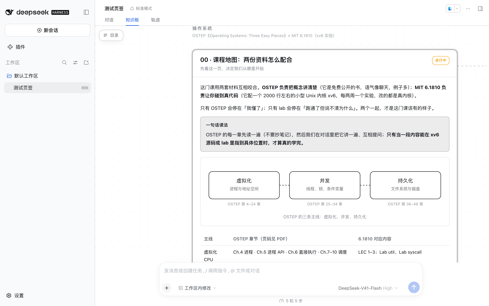

# 知识板（dsh-knowledge-board）

DeepSeek Harness 的客户端插件：在对话区顶部加一个**与「对话 / 轨迹」并列的页签**，用一张**无限画布**展示持久化的学习内容。内容以 JSON 文件存在工作区里，Agent 用普通文件工具写，页面轮询到变化就更新。

它是为「对话学习」这种用法做的：**对话是课堂**（讲解、追问、答疑，只说你当下最该听的那几句），**知识板是黑板加教材**（概念、图表、对照表、自测题、来源、未解问题都在上面，能长期累积和回看）。Agent 通过写一个 focus 文件就能把画布移到正在讲的节点——所以「看板子」是一句话的事，不用你手动找。

每个节点是画布上的一张卡片，同一方向的卡片横向排开并用虚线相连。**画布上只有一处常驻界面**：左上角一个小按钮（点开是目录）。没有顶栏、没有缩略图——平移、缩放、看全景全是手势，刷新藏在目录面板的角落里（正常不需要它，每 2 秒自动轮询）。卡片位置可以拖动，你自己的摆法记在浏览器本地，不会写回文件。



## 画布操作

| 操作 | 效果 |
| --- | --- |
| 在空白处拖动 / 触控板双指滑动 | 平移画布 |
| `⌘`/`Ctrl` + 滚轮、或触控板捏合 | 以指针为中心缩放（8%–240%） |
| 双击空白处 | 看全景（适应全部内容） |
| 拖动卡片顶部标题栏 | 移动这张卡片（位置存在浏览器本地） |
| 点击卡片标题栏 | 缩放并居中到这张卡片 |
| 左上角「目录」按钮 | 下拉出方向/节点列表，点条目跳转；点别处或按 `Esc` 收起。面板左下角显示 Agent 当前的 focus 说明，右下角是「刷新」 |

## 结构

| 文件 | 作用 |
| --- | --- |
| `package.json` | 包清单。`dsh.bundle.patch` 让它成为一个 bundle 层；`dsh.client` 声明浏览器半。 |
| `cordis.patch.yml` | bundle 的补丁层：插入一条 `knowledge-board` 条目。内容目录默认从包位置推导（`<仓库>/learning`），可用 `config.contentRoot` 覆盖。 |
| `lib/index.js` | **host 半**。注册只读路由 `/board-api`，直接读内容文件，无缓存。 |
| `lib/client.js` | **浏览器半**。手写 bundle（`window.__ModuleLoader__.load`），把知识板注册进 `conversation.view` 槽位（顶部页签 + 正文），画布、布局、手势与全部渲染逻辑都在这里。 |
| `locale/{zh,en}.json` | 插件管理页里显示的标题与说明。 |

页签位置由 `order` 决定：`对话 = 0`、`知识板 = 5`、`轨迹 = 10`。改 `lib/client.js` 里 `register(...)` 的 `order` 即可调整顺序。

### 画布布局

`buildLayout()` 是纯函数：一个方向 = 一条横向带状区，节点从左到右排，每 3 张换行；卡片高度由**渲染后测量**（`offsetHeight`）得到，所以第一次绘制用估值、量到真实高度后重排一次即收敛，不会来回抖。用户拖动过的卡片位置以覆盖层形式参与布局。调 `ROW_MAX`、`GAP_X`、`GAP_Y`、`CARD_W` 可以改排布密度。

## 安装

官方通道（客户端里操作）：

1. 侧栏 **插件 → Add plugin**
2. 填这个绝对路径：`/Users/zeyuan/wawa/tooling/dsh-knowledge-board`
3. Install → Enable now
4. 刷新窗口（新增的客户端插件需要页面重新加载才会出现）

这条路径等价于 `dsh plugin --profile desktop add <绝对路径>`：pnpm 以 `link:` 方式装进 profile，再把包名追加到 `dsh.profile.bundles`。因为是 link，改代码不用重新安装。

**改动 `lib/index.js`（host 半）后必须完全退出客户端再打开。** 只刷新页面不够：host 半是 Node 模块，进程内不会重新加载新代码；`lib/client.js` 则会热重载（500ms 轮询）。两者版本不一致时客户端会降级——`/board-api/board` 返回 404 就退回逐节点读取，画板照常可用，但请求变多，且顶栏会挂一条「接口报错」横幅。看到那条横幅就是该重启了。

卸载：插件页里禁用或移除，然后把 profile 里 `dsh.profile.bundles` 中的 `dsh-knowledge-board` 去掉。

## 内容格式

**这套格式与学科无关**，本文档不为任何具体学科而写。内容根目录（默认 `<仓库>/learning`，从包位置推导，可用 `config.contentRoot` 指向别处）下**每个子目录 = 一个方向**——一门学科、一个长期主题都算；每个方向各放一份 `board.json`，画布把根目录下所有方向一起画出来。**加一个方向就是加一个目录**，不需要改插件，也不需要改本文档。

```json
{
  "direction": "example",
  "title": "示例学科",
  "subtitle": "副标题，显示在方向标签旁",
  "nodes": [
    { "id": "intro", "title": "00 · 起点", "subtitle": "先看这一页", "status": "learning",
      "blocks": [ { "type": "md", "text": "..." } ] }
  ]
}
```

`direction` 建议与目录名一致；某个方向的文件缺失或读不动时，只有那个方向受影响，其余照常显示。

`status` 取 `planned` / `learning` / `done`，显示为卡片标题栏上的小标签（待开始 / 进行中 / 已完成）。

### 块类型

| type | 用途 | 关键字段 |
| --- | --- | --- |
| `md` | 正文。支持标题、**加粗**、`行内代码`、[链接](url)、列表、引用、代码围栏 | `text` |
| `key` / `note` / `warn` | 结论卡 / 补充卡 / 警示卡 | `title`、`text` |
| `table` | 对照表、章节清单 | `columns`、`rows`（二维数组） |
| `code` | 代码片段 | `title`、`lang`、`text` |
| `compare` | 左右对比 | `left`/`right` = `{title, text}` |
| `steps` | 有序步骤 / 时间线 | `items` = `[{label, text}]` |
| `sources` | 来源清单（务必带链接与访问说明） | `items` = `[{title, url, note}]` |
| `questions` | 未解问题 / 下次入口 | `items` = 字符串数组 |
| `quiz` | 可折叠自测卡（点开看答案） | `items` = `[{q, a}]` |
| `lab` | 实验任务与进度 | `title`、`status`、`text`、`link` |
| `figure` | 手写 SVG 图 | `svg`（属性用单引号，避免 JSON 转义）、`caption` |

选哪种块由内容决定：概念用 `md`，结论用 `key`，机制对照用 `table`/`compare`，结构用 `figure`，复习用 `quiz`。

### 写内容时容易踩的地方

写板子的是普通文件工具，没有校验，所以下面这几条靠自觉：

- **节点粒度 = 卡片粒度**：一张卡片讲一个主题（一节课、一个机制）。卡片高度就是内容高度，几百行的节点在「看全景」时会缩得没法读，这时用目录跳转更顺手。
- **`direction` 与节点 `id` 是普通字符串**，focus 文件按**精确匹配**定位节点——改 `id` 等于换了一个节点，旧的手动摆位也会失配。建议保持简短 ASCII；`direction` 缺省时用目录名。
- **`figure` 的 `svg` 是直接插入的原始标记**，两条硬要求：必须带 `viewBox`（样式只给 `max-width:100%;height:auto`，没有 viewBox 就没有宽高比）；颜色用 `currentColor`（样式表把 `color` 设成了主题前景色，深色/浅色都正确；写死 `#333` 会在暗色主题下失效）。字号用 `font-family='inherit'` 跟随界面字体。
- **`lab.status`** 取 `todo` / `doing` / `done`（未开始 / 进行中 / 已完成），其他值一律按未开始显示。
- **顶层 `source` 与节点 `updated` 目前不渲染**：host 会原样返回，界面不显示。写它们无害，但需要给人看的时间与出处请写进块内容（`md`、`sources`）。
- **加一个方向就是加一个文件**：新建 `learning/<方向>/board.json` 即可，无需注册，画布上会自动多出一条带状区。

## 引导页面（Agent 用）

写 `<仓库>/learning/.board-focus.json` 即可让所有打开的页面切到该节点：

```json
{ "direction": "example", "node": "intro", "note": "讲到这里", "ts": 1759590000 }
```

`ts` 变化才会重新触发切换（同一个节点重复写不会打断你手动翻页）。页头会显示 `note`。

## 接口

host 半注册的只读路由（`GET`，JSON，`cache-control: no-store`）：

- `/board-api/manifest` — 方向与节点索引、文件修订号 `rev`、当前 focus。每 2 秒轮一次，便宜。内容目录读不到时返回 200 并带 `error` 字段，页面会直接显示原因。
- `/board-api/board` — 所有方向 + 节点的完整块列表。画布要同时画所有卡片，`rev` 变化时取一次。
- `/board-api/node?direction=<方向>&id=<节点>` — 单个节点的块列表（排查用）。
- `/board-api/health` — `{ok, root, name}`，用于确认内容目录。

客户端数据流：轮询 manifest → `rev` 变了才重新取 `/board` → 重新测量卡片高度并重排。

## 开发与验证

不需要构建步骤：`lib/client.js` 就是最终产物，`node --check` 即可做语法检查。改 `lib/client.js` 后会被客户端热重载（500ms 轮询）；改 `lib/index.js`（host 半）必须重启客户端。

隔离验证（不碰正在使用的客户端）：

```sh
# 复制一份 profile 到临时 DSH_HOME，用 --patch 覆盖层启动，另开端口
DSH_HOME=/tmp/dshhome "/Applications/DeepSeek Harness.app/Contents/Resources/runtime/cli/bin/dsh" \
  --profile test --patch /tmp/board.yml --no-open --port 19399

# 覆盖层内容（指向工作区里的插件，不必安装）
# - insert:
#     - id: knowledge-board
#       name: /Users/zeyuan/wawa/tooling/dsh-knowledge-board/lib/index.js

curl -s http://127.0.0.1:19399/board-api/health
curl -sN --max-time 4 http://127.0.0.1:19399/plugins/events   # 客户端插件 boot 图（无需 token）
```

界面验证用无头 Chrome + CDP（`Page.captureScreenshot` + `Runtime.evaluate` 探测 DOM 和控制台），比肉眼点更早发现问题。

## 已知限制

- **轮询而非推送**：2 秒一次。要更实时可以改成 SSE（`ctx.webServer.register` + `text/event-stream`）。
- **host 半改动要重启客户端**：见上文。客户端对版本不一致做了降级，所以不会彻底坏掉。
- **错误提示不挡画布**：已经有卡片时，报错只挂一条横幅；只有完全没内容时才整层覆盖。
- **界面只保留一处常驻控件**：左上角目录按钮。加新控件前先想清楚它是不是能用现有手势替代——顶栏那一版就是因为堆了太多按钮被拿掉的。
- **节点一次全量返回**：内容特别多时没有分页，`/board-api/board` 会一次给全。
- **写入只由 Agent 做**：客户端插件在 DSH 里没有工作区写通道。画布上的卡片位置只存在浏览器 localStorage，换机器或清缓存就回到自动排布。
- **画布高度靠测量**：对话视图按 `flex:1 0 auto` 让内容撑开、由外层滚动，所以画布用「滚动区高度 − `--dsh-composer-height`」给自己定高，这样外层不滚动、画布内部平移。换掉这个祖先结构就要重新测。
- **卡片高度即内容高度**：很长的节点会是一张很高的卡片，双击空白看全景时会缩得比较小；这时用目录跳转更顺手。
- **平移与缩放的性能约定**：卡片子树用 `useMemo` 记忆化（平移只改外层 transform，不重建卡片），指针移动和滚轮每帧只提交一次状态。破坏这两条约定就会重新变卡——别把随视图变化的值塞进卡片渲染。
- **空白会话没有页签**：会话处于 hero（还没发过消息）时，对话视图区整个不渲染，页签也随之不可见。发一条消息后出现。
