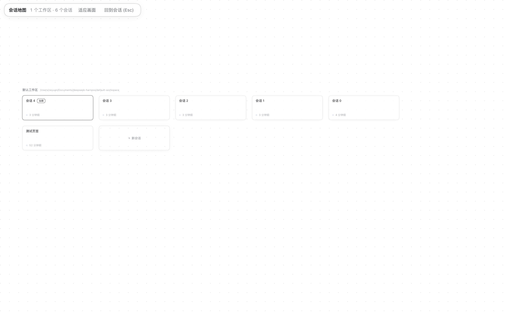

# 会话地图（dsh-session-map）

DeepSeek Harness 的客户端插件：把**工作区和会话铺成一整窗画布**。每个工作区是一条带状区，每个会话是一张卡，卡片实时显示它现在在干什么。`⌘⇧M` 切换地图与当前会话；在地图上点一张卡就进入那个会话。

这是"整个 DSH 变成一张无限画布"这个想法的第一步：**全部使用官方扩展点**（`main` 槽位、`shortcuts` 服务、`ctx.layout`、`ctx.uiWorkspace`），没有改主题、没有改布局、没有覆盖任何 CSS 变量。所以它升级时最不容易坏。

## 交互

| 操作 | 效果 |
| --- | --- |
| `⌘⇧M`（`Ctrl+Shift+M`） | 地图 ⇄ 当前会话 |
| 点卡片 | 打开那个会话（并切回对话） |
| 点 `＋ 新会话` | 在该工作区新建会话 |
| 空白处拖动 / 触控板双指 | 平移 |
| `⌘`/`Ctrl` + 滚轮、捏合 | 缩放（20%–160%） |
| 双击空白处 / 「适应画面」 | 全景 |
| `Esc` / 「回到会话」 | 切回对话 |

## 卡片状态

状态直接来自客户端已有的 `useSessionStatus`，所以四种状态都是真的：

| 表现 | 含义 |
| --- | --- |
| 绿色边框 + 「在跑」 | 模型在生成或工具在执行 |
| 橙色边框 + 「待确认」 | 在等你批准 / 回答 |
| 蓝色圆点 + 「未读」 | 你不在的时候跑完了 |
| 变暗 | 空闲 |

另有：当前会话带「当前」描边和标签；标题下方是相对时间；如果这个会话有子智能体正在跑，会显示「· N 个子智能体」。

## 侧边栏：默认不动，由你决定

**首次安装不会碰你的侧边栏。** 地图顶栏有一个 `收起侧边栏` 按钮，你点了才会收起，并且记住这个选择，之后每次启动自动保持；想改回来就点同一个按钮（它此时显示 `展开侧边栏 (⌘B)`）。

这个默认是刻意的：插件页（也就是卸载插件的地方）在侧边栏里，一个"会自己把侧边栏藏起来"的插件不应该在你还不知道怎么退出去的时候就生效。

在 macOS 桌面版上，收起会让**整列归零**（官方行为，不是覆盖 CSS），原本在侧栏的「展开侧边栏」和「新会话」会移到左上角的浮动控制区，悬在主面板之上。判断"是否已收起"是读框架自己写的内联 `grid-template-columns`：macOS 桌面版收起是 0，Web 版留 56px 轨道，展开至少 264px，所以用 120px 作阈值同时覆盖两种情况。

另外侧栏切换本身是官方快捷键 **`⌘B`**（布局插件注册的 `sidebar.left.toggle`，在输入框里也生效），所以在任何情况下都有一条键盘退路。

## 卸载与回退

三层，从轻到重：

1. **禁用（立刻生效，推荐先试这个）**：侧栏 **插件** → 找到「会话地图」→ 关掉它的开关。这个开关调 `pluginManager.setPluginEnabled`，只是往 profile 的 `cordis.patch.yml` 里写一条 `disabled`，**在开了 HMR 的 profile 上立刻重组，插件当场卸载，不用重启**，其余插件照常跑。
2. **卸载**：同一个卡片/详情页里的「移除（uninstall）」动作，**会先要确认**。装上去的 bundle 可以开关和移除；安装体自带的 bundle 是锁定的。
3. **绕开界面**（如果连侧栏都打不开）：`⌘B` 打开侧栏；或者在 macOS 上点左上角红绿灯旁边的「展开侧边栏」浮动控件。
4. **最后手段**：直接改 profile —— 从 `~/.dsh/profiles/desktop/package.json` 的 `dependencies` 和 `dsh.profile.bundles` 里去掉 `dsh-session-map`，删掉 `node_modules/dsh-session-map` 链接，重启客户端。这一步也可以让我来做。

**如果地图面板本身崩了**，不会把你锁住：`main` 槽位的错误边界会把这张面板摘掉，自动回落成对话——所以最坏情况是你看到的是普通对话界面，而不是黑屏。

## 结构

| 文件 | 作用 |
| --- | --- |
| `package.json` | 包清单。`dsh.bundle.patch` 让它成为一个 bundle 层。 |
| `cordis.patch.yml` | bundle 的补丁层：插入一条 `session-map` 条目。无配置。 |
| `lib/index.js` | **host 半**：目前是空操作。地图读的都是客户端已经订阅的快照，host 无事可做。留着它是因为 cordis 条目是浏览器半被发现的途径。 |
| `lib/client.js` | **浏览器半**：面板、布局、手势、状态色、快捷键、侧栏收起。 |

### 布局是纯函数

卡片是**固定尺寸**（302×104），所以布局不需要"先估值再测量"那套：`buildLayout(bands)` 直接算位置，每个工作区一条带，每行 5 张换行，末尾追加一张"新会话"卡。工作区之间留 `BAND_GAP`。

**记忆的视图是按卡片集合的形状（shape）记的**：会话增减会改变形状，这时重新适应画面，而不是恢复一个可能把新卡片留在屏幕外的旧视图。这是我在测试里踩到的——旧的 160% 视图把新卡片顶出了右边界。

## 已知限制

- **包含归档会话**：归档集合存在工作区存储里，不在任何客户端可读的 store 里，所以地图目前不过滤它。归档会话点开会触发应用自己的"不可打开"提示。要修的话，host 半可以读 `$DSH_HOME/storages/workspace.json` 里的 `global.archivedSessionIds` 并开一条路由——留了位置。
- **不显示子智能体会话为独立卡片**：与官方侧栏一致（它按 `origin === 'subagent'` 过滤），改为在父卡上显示正在跑的子会话数量。
- **不能跨工作区拖动会话**：官方没有这个接口（工作区是目录，会话归属由 cwd 决定）。
- **卡片不能拖动排序/固定/归档**：这些操作在地图上没有复刻，侧栏展开后仍可做。
- **只在窗口内**：桌面级悬浮（飘到别的应用之上）不属于插件能力范围。
- **侧栏收起是"记住上次选择"而不是"永远收起"**：官方展开控件改动的是布局状态，插件读得到；如果你更希望"永远自动收起、不听上次选择"，说一声就好。

## 验证（2026-10-05）

在隔离实例（`DSH_HOME=/tmp/dshhome`，另一个端口）里做的，不碰正在使用的客户端：

| 项 | 结果 |
| --- | --- |
| 三个插件同时进 boot 图 | ✅ 68 个条目，第三方 3 个 |
| 快捷键切换地图 | ✅ `⌘⇧M` 合成事件即可切换 |
| 启动自动收起侧栏 | ✅ 内联列宽从展开变成收起值 |
| 点卡片进入会话 | ✅ 地图关闭、对话页签出现、打开的正是那张卡 |
| `＋ 新会话` | ✅ 用它连开 5 个会话 |
| 多卡片布局 | ✅ 6 个会话换行成 5+1，工作区标签正确 |
| 布局数学 | ✅ 12 个会话 → 13 张卡、行数 5/5/3、两条带 0/218、稀疏时拟合不超过 100% |
| 控制台报错 | 0 |

**未验证**（这台测试机是 Web 变体，`data-platform` 为空）：

- macOS 桌面版上"收起 = 整列归零"以及左上角浮动控制区的位置——这是官方文档描述的行为，我用 CSS 里的 `--dsh-frame-leading-clearance` / `--dsh-frame-top-clearance` 给左上角留了空间，但真机效果要你打开才知道。
- 真机上多工作区（你现在有 4 个）的带状分区的观感。
